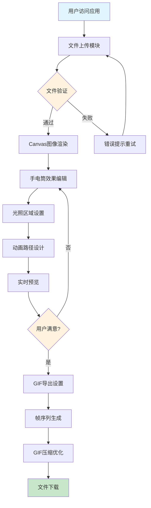
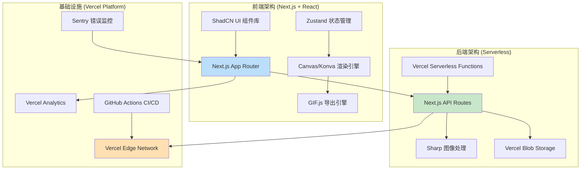
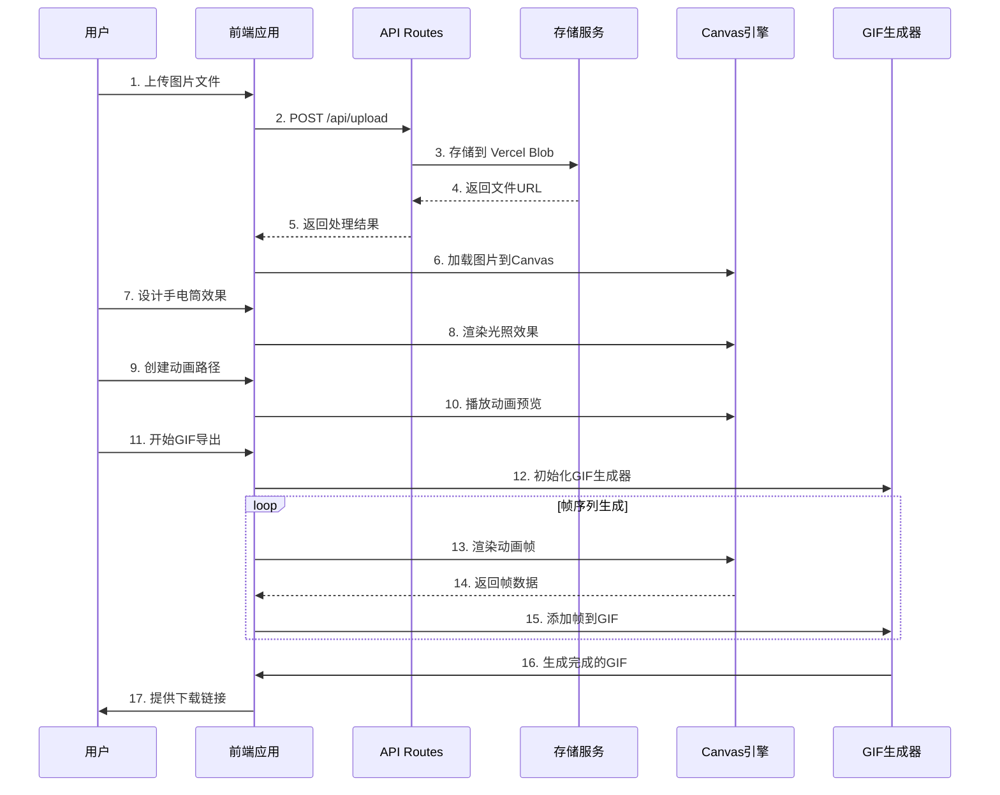
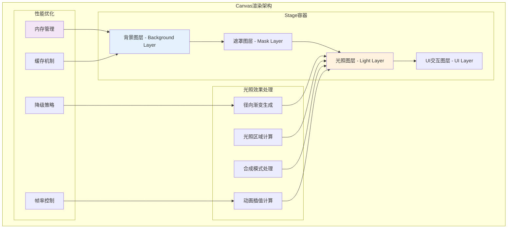
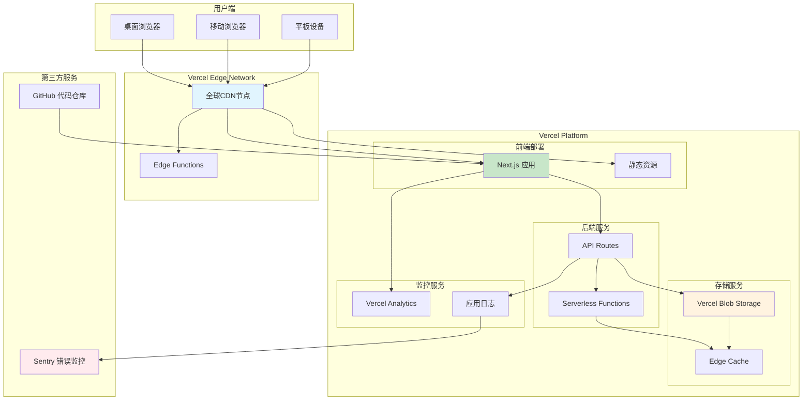
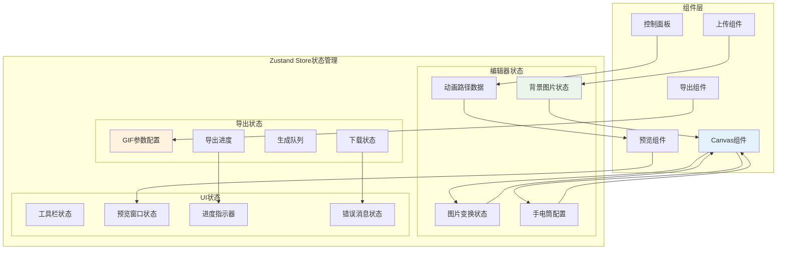

# Labubu 手电筒效果项目 - 流程图集合

## 📋 文档说明
本文档包含Labubu手电筒效果项目的所有关键流程图，用于技术实现、架构设计和开发指导。

---

## 🎯 1. 用户操作流程图

**流程说明**:
- 用户从文件上传开始，经过验证后进入编辑模式
- 编辑包括手电筒效果设置、动画路径设计和实时预览
- 满意后进入GIF导出流程，最终下载成品

---

## 🏗️ 2. 技术架构图

**架构说明**:
- **前端**: 基于Next.js的React应用，使用ShadCN UI和Canvas渲染
- **后端**: Serverless架构，基于Next.js API Routes
- **基础设施**: 完全基于Vercel平台的现代化部署

---

## 🔄 3. 数据交互时序图

**交互说明**:
- 文件上传流程：前端→API→存储→返回URL
- 编辑流程：用户操作→Canvas渲染→实时预览
- 导出流程：帧生成循环→GIF合成→下载

---

## 🎨 4. Canvas渲染架构图

**渲染架构说明**:
- **图层管理**: 背景、遮罩、光照、UI四层结构
- **光照处理**: 径向渐变、区域计算、合成模式
- **性能优化**: 内存管理、帧率控制、降级策略

---

## 🚀 5. 部署架构图

**部署架构说明**:
- **用户接入**: 多端设备通过CDN访问
- **核心服务**: Next.js应用+API Routes+存储
- **监控体系**: Analytics+日志+错误监控

---

## 📊 6. 状态管理架构图

**状态管理说明**:
- **编辑器状态**: 图片、变换、手电筒、动画数据
- **UI状态**: 工具栏、预览、进度、错误信息
- **导出状态**: GIF参数、进度、队列、下载

---

## 📚 图表使用指南

### 🎯 开发阶段使用
1. **需求分析**: 参考用户操作流程图
2. **架构设计**: 参考技术架构图和部署架构图
3. **功能开发**: 参考Canvas渲染架构图和状态管理图
4. **接口设计**: 参考数据交互时序图

### 🔧 实施阶段使用
1. **前端开发**: Canvas架构图+状态管理图
2. **后端开发**: 技术架构图+数据交互图
3. **部署运维**: 部署架构图
4. **测试验证**: 用户操作流程图

### 📖 文档维护
- 每个功能模块完成后更新对应流程图
- 架构变更时及时同步图表内容
- 定期review图表的准确性和完整性

---

## 🔗 相关文档链接
- [技术实现方案详细文档]
- [TODO任务清单]
- [API接口文档]
- [部署配置文档]

---

**文档版本**: v1.0  
**创建时间**: 2024年1月  
**维护团队**: Labubu Studio开发团队 